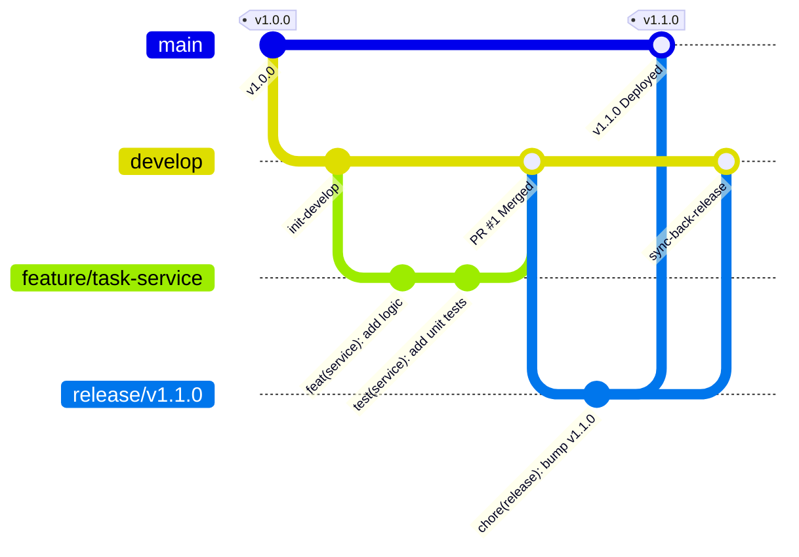

# Team Branching Strategy & Collaboration Standards

## 1. Executive Summary & Objective

This document defines the official Git branching strategy, release management protocols, and code review standards for the backend engineering team. Our model follows an enhanced **GitHub Flow / Trunk-Based hybrid** optimized for agility, continuous integration, code quality, and production stability.

---

## 2. Branch Hierarchy & Taxonomy

We maintain two persistent long-lived branches, complemented by ephemeral short-lived branches created for specific units of work.

```text
[main] (Production-ready / Protected)
  ▲
  │ (Release PR / Hotfix PR)
  │
[develop] (Integration & Staging / Protected)
  ▲                  ▲                  ▲
  │                  │                  │
[feature/*]      [bugfix/*]         [refactor/*]
(Short-lived)    (Short-lived)      (Short-lived)
```

| Branch Type | Lifetime | Base Branch | Merge Target | Purpose & Constraints |
| :--- | :--- | :--- | :--- | :--- |
| `main` | Permanent | *None* | *None* | **Production Source of Truth**. Every commit on `main` is deployable to production. Direct commits and force pushes are blocked. |
| `develop` | Permanent | `main` | `main` | **Integration & Staging**. Aggregates features and fixes for the upcoming release candidate. Deployed to staging environment. |
| `feature/*` | Ephemeral (< 3 days) | `develop` | `develop` | **New feature development**. Scoped to a single ticket or user story. Created from `develop`, merged back via Pull Request. |
| `bugfix/*` | Ephemeral (< 2 days) | `develop` | `develop` | **Non-critical bug fixes** targeting issues detected in development or staging environments. |
| `hotfix/*` | Ephemeral (< 24 hrs) | `main` | `main` & `develop` | **Critical production incident fixes**. Fast-tracked to `main` with dual merge back into `develop` to prevent regression. |
| `release/*` | Ephemeral (< 3 days) | `develop` | `main` & `develop` | **Release stabilization**. Freezes code for final QA, metadata bumps, and deployment dry-runs. |

---

## 3. Branch Naming Conventions

All branch names must be lowercase, hyphen-separated, and prefix-scoped according to the work category.

### Format Pattern
```text
<type>/<ticket-id>-<short-description>
```

### Examples
- **Features**: `feature/backend-104-task-service-layer`
- **Bug Fixes**: `bugfix/backend-108-fix-null-pointer-due-date`
- **Refactoring**: `refactor/backend-112-standardize-custom-exceptions`
- **Hotfixes**: `hotfix/backend-120-cors-security-header-patch`
- **Releases**: `release/v1.1.0`

### Naming Rules
1. Never use generic branch names like `my-branch`, `test`, `dev`, or developer names like `john/patch`.
2. Always include the Jira/GitHub issue tracker key if applicable.
3. Keep the descriptive summary under 4 words (e.g., `add-rate-limiter`).

---

## 4. Branching Lifecycle Workflow



### Step-by-Step Runbook:

1. **Sync Base Branch**:
   ```bash
   git checkout develop
   git pull origin develop
   ```

2. **Create New Feature Branch**:
   ```bash
   git checkout -b feature/backend-104-task-service-layer
   ```

3. **Atomic Commits with Meaningful Messages**:
   Make focused changes, following the Conventional Commits specification.
   ```bash
   git add tasks/services.py tasks/tests.py
   git commit -m "feat(tasks): implement TaskService domain logic and metrics"
   ```

4. **Rebase on Latest Develop Before Opening PR**:
   ```bash
   git checkout develop
   git pull origin develop
   git checkout feature/backend-104-task-service-layer
   git rebase develop
   ```

5. **Push and Open Pull Request**:
   ```bash
   git push origin feature/backend-104-task-service-layer
   ```

---

## 5. Commit Message Standards (Conventional Commits 1.0.0)

Every commit must follow this format:

```text
<type>(<scope>): <short imperative summary>

[optional body explaining motivation and architectural trade-offs]

[optional footer(s) referencing issue keys or breaking changes]
```

### Allowed Types:
- `feat`: A new user-facing or architectural feature.
- `fix`: A bug fix.
- `docs`: Documentation-only changes (README, architecture docs).
- `style`: Formatting, missing semi-colons, no code logic changes.
- `refactor`: Code change that neither fixes a bug nor adds a feature.
- `perf`: Code change that improves performance or latency.
- `test`: Adding missing tests or correcting existing tests.
- `chore`: Changes to build process, dependency bumps, or tool configs.

### Examples:
- `feat(tasks): add status transition auditing in TaskService`
- `fix(core): resolve database latency rounding issue in health check`
- `refactor(utils): centralize pagination logic into StandardResultsSetPagination`
- `docs(readme): add development setup and branching guidelines`

---

## 6. Pull Request (PR) & Code Review Policy

### Requirements for Merging:
1. **At Least 1 Peer Approval**: Every PR must be reviewed and approved by a senior engineer or code owner.
2. **Automated CI Validation**: All test suites, flake8 lint checks, and black format checks must pass with zero failures.
3. **No Unresolved Discussions**: All review comments must be explicitly addressed or resolved.
4. **Up-to-Date with Target Branch**: Feature branch must be rebased or synced with target branch prior to merge.

### Merge Method:
- **Default for Feature Branches**: **Squash and Merge**
  - Keeps `develop` and `main` history clean, linear, and readable.
  - Generates a single concise commit on the integration branch.
- **For Release & Hotfix Merges**: **Merge Commit (`--no-ff`)**
  - Preserves the distinct branch topology and release milestone tag.

---

## 7. Branch Protection Rules

Configured in GitHub repository settings for `main` and `develop`:

| Rule | `main` | `develop` |
| :--- | :---: | :---: |
| Require Pull Request before merging | **Yes** | **Yes** |
| Required Approving Reviews | **2** | **1** |
| Dismiss stale pull request approvals | **Yes** | **Yes** |
| Require status checks to pass (CI tests & lint) | **Yes** | **Yes** |
| Require branches to be up to date before merging | **Yes** | **Yes** |
| Require conversation resolution | **Yes** | **Yes** |
| Require signed commits | **Yes** | Optional |
| Require linear history | Optional | **Yes** |
| Do not allow bypass (Enforce for Administrators) | **Yes** | **Yes** |
| Restrict deletions and force pushes | **Yes** | **Yes** |

---

## 8. Hotfix Protocol (Production Incidents)

When an urgent defect is identified in production:
1. Create a `hotfix/*` branch directly from `main`:
   ```bash
   git checkout main
   git pull origin main
   git checkout -b hotfix/backend-121-fix-auth-token-parsing
   ```
2. Implement minimum viable fix and write regression tests.
3. Open an expedited PR directly into `main` marked with `[URGENT]`.
4. Once reviewed and CI passes, merge into `main` and tag the patch release (e.g. `v1.0.1`).
5. **Immediately back-port** the hotfix into `develop`:
   ```bash
   git checkout develop
   git pull origin develop
   git merge --no-ff hotfix/backend-121-fix-auth-token-parsing
   git push origin develop
   ```
